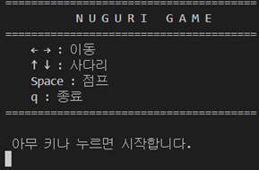
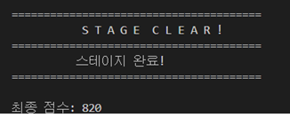
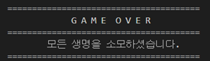

# 너구리 게임 (Nuguri Game)

## GitHub 주소
```
https://github.com/Byeongil19/Nuguri03
```

## 학번 / 이름
- 20223120 / 안병일 
- 20243099 / 박상준
- 20213082 / 구주안
- 20235237 / 방서연

## OS별 컴파일 및 실행 방법(기본적으로 시스템 소리와 vscode 소리를 올려주세요.)

### Windows
```bash
# 컴파일
gcc -o nuguri.exe nuguri.c

# 실행
nuguri.exe
```

### Linux
```bash
# 컴파일
gcc -o nuguri nuguri.c

# 실행
./nuguri
```

### macOS
```bash
# 컴파일
gcc -o nuguri nuguri.c

# 실행
./nuguri
```

## 구현 기능 리스트

### main() 로직
```
main()
 ├─ enable_raw_mode()
 ├─ title_screen()
 ├─ detect_size() 
 ├─ alloc_map()
 ├─ load_maps()
 ├─ init_stage()
 └─ while (!game_over)
        ├─ update_game()
        │    ├─ move_player()
        │    ├─ move_enemies()
        │    └─ check_collisions()
        └─ draw_game()
```
### 필수 구현 기능
- **크로스 플랫폼 지원**
  - Windows 환경 지원 (conio.h 사용)
  - Linux/macOS 환경 지원 (termios.h 사용)
  - 전처리기를 통한 OS별 코드 분리
  - 화면 클리어 함수 호환성 구현
  - 대기 함수 호환성 구현 (Sleep/usleep)

- **생명력 시스템**
  - 플레이어에게 3개의 생명(Heart) 부여
  - 적과 충돌 시 생명 감소(heart_discount())
  - 생명 0일 때 게임 종료

- **타이틀 및 엔딩 화면**
  - 게임 시작 전 타이틀 화면(title.txt)
  - Game Over 화면(gameover.txt)
  - 게임 클리어 화면(clear.txt)

### 선택 구현 기능 
- **동적 맵 할당**
  - map.txt의 실제 가로·세로 크기를 계산(detect_size())
  - 계산된 값에 따라 alloc_map()에서 2차원 배열을 malloc으로 동적 생성
  - 클리어 후 스테이지 전환 시 free_map() 후 재할당

- **사운드 효과**
  - OS별 시스템 비프음 구현(beep_sound())

## 게임 스크린샷

### 타이틀 화면



### 클리어 화면


### 게임 오버 화면


## 개발 중 발생한 OS 호환성 문제와 해결 과정

### 1. 키보드 입력 처리 문제
**문제점:**
- 플레이어 이동을 위한 키 입력을 getchar()로 받았을 때 Windows에서는 키 입력 이후 엔터를 입력해야 키 입력이 일어나는 상황 발생.

**해결 방법:**
```
#ifdef _WIN32 전처리 지시어를 사용하여 Windows에서는 getch()를 사용하여 입력을 받도록 하고 Linux, macOS환경에서는 getchar()로 입력을 받도록 함.
```

### 2. 화면 클리어 함수 차이
**문제점:**
- Windows에서는 clrscr()가 정상적으로 동작하지 않는 문제 발생, 화면이 깜빡이거나 망가지는 문제 발생.

**해결 방법:**
```
Windows에서는 화면 깜빡임을 줄이기 위해 전체 지우기 대신 gotoxy() 를 사용해 커서를 (1,1) 위치로 이동시키고 main에서 printf("\033[?25l");//커서숨기기, printf("\033[?25h")//커서활성화 활용.
```
### 3. Sleep 함수 차이
**문제점:**
- Windows: Sleep(ms) - 밀리초 단위
- Linux/macOS: usleep(us) - 마이크로초 단위

**해결 방법:**
```
Windows의 경우:
- windows.h 헤더 포함
- Sleep(ms) - 밀리초 대기

Linux/macOS의 경우:
- unistd.h 헤더 포함  
- usleep(ms * 1000)

#ifdef _WIN32 전처리 지시어로 컴파일 시점에 OS를 판단하여 각 플랫폼에 맞는 함수가 사용되도록 해결했습니다.
```

### 4. 입력 키를 꾹 눌렀을 때 버퍼 연속 입력 문제
**문제점:**
- 방향키를 길게 눌렀을 때, 버퍼에 입력이 계속 발생하여 키를 떼었을 때도 이동이 이루어짐.

**해결 방법:**
```
while (kbhit()) {
     char b = getchar();
        if(b == ' ' && !is_jumping) {
                ungetc(b, stdin);
                break; 
          }
}
char b = getchar();를 사용하여 입력 버퍼를 지우도록 함. 그리고 if 조건문으로 점프 입력시 점프 버퍼까지 지워지는 상황을 예방.
```

### 5. 시스템 비프음 출력 방식의 차이
**문제점:**
- OS환경마다 사운드를 출력하는 방식이 다름.

**해결 방법:**
```
Windows 환경에서는 printf("\a")를 사용할 수 없기때문에 Beep(750, 120)을 사용함.
```
## 점프 로직 수정
**점프력 부여**
```
- 점프시 velocity_y의 값 만큼 y축으로 한칸씩 변화
- 점프이후 y축 방향으로 이동할 때마다 velocity_y값 증가
- velocity_y값이 음수라면 우리 기준 상승하고 0 일때는 허공에 체공하며 양수라면 하락한다.
```
**점프시 이전이동방향 기억**
```
-이동 중 스페이스바를 누르는 순간 제자리 점프만 뛰는 것을 방지
-이전 좌, 우 키 입력을 기억하고 점프 시 해당 방향으로 이동
-다시 키 입력을 하면 해당방향으로 점프하는 것을 끊을 수 있다.
```

## 게임 조작법
- `←`, `→`: 좌우 이동
- `↑`, `↓`: 사다리 오르내리기
- `Space`: 점프
- `q`: 게임 종료

## 게임 요소
- `P`: 플레이어
- `#`: 벽
- `H`: 사다리
- `X`: 적
- `C`: 코인
- `S`: 시작 지점
- `E`: 출구 (다음 스테이지)